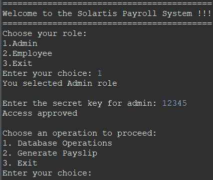
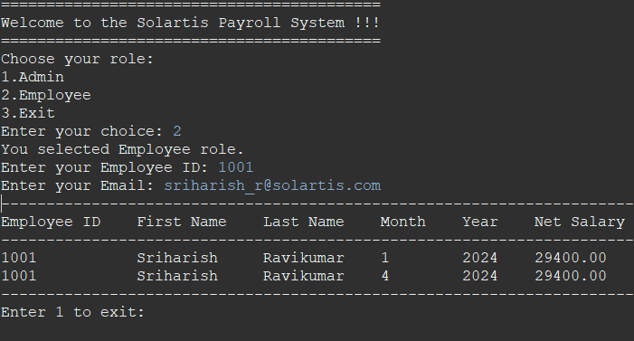
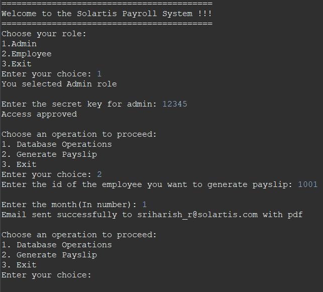
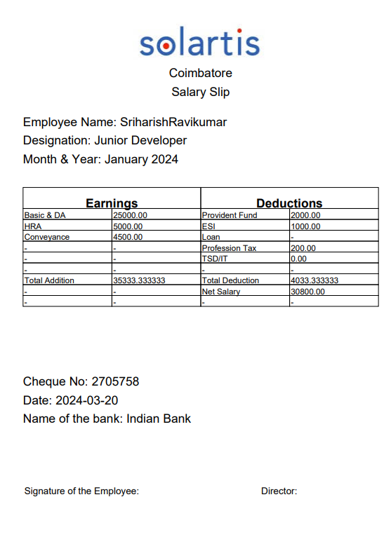

# Payroll System

## Overview

The Payroll System is a simple console-based application designed to manage payroll-related tasks for a company. It provides functionalities to generate pay slips, allocate salaries based on designations and departments, calculate leave-based salaries, perform tax calculations, manage night shift allowances, and distribute payslips to employees via email.

### Key Features

- **Roles**: Supports two roles - Admin and Employee - each with specific permissions.
- **Pay Slip Generation**: Generates pay slips for a given month, including detailed salary breakdowns.
- **Salary Allocation**: Allocates salaries based on various designations and departments, considering allowances and deductions.
- **Leave-Based Salary Calculations**: Calculates salaries based on leave taken by employees.
- **Tax Calculations**: Performs simple tax calculations based on salary with rounding off.
- **Night Shift Allowance**: Includes allowance for employees working night shifts.
- **Payslip Distribution**: Sends payslips to employees via email in text or PDF format.

## Installation

### Download
Visit the [Download](https://github.com/harish96880/Payroll_v01/) website for more information.

### Database Setup
1. Install the provided SQL (Payroll_SQL.SQL) file in your MySQL Workbench.
2. This file contains the necessary database schema and initial data required for the Payroll System to function properly.

### Configuration
1. Open the `CreatePDF.java` file in your preferred text editor.
2. Locate the following lines of code:
    ```java
    private static final String pdfDirectory = "D:/Payroll_PDF V01/"; //Change the Pdf Directory to your location
    private static final String pdfName = "salary_details.pdf";
    private static final String imagePath = "D:/Payroll_PDF V01/logo.png"; // Change the logo Directory to your location
    ```
3. Modify the `pdfDirectory` variable to specify the directory where PDF files will be saved.
4. Modify the `imagePath` variable to specify the directory where the logo image is located.

### Compile and Run
1. After setting up the database and configuring the file paths, compile and run the main file `PayrollApplication.java`.
2. Ensure that you have the necessary Java Development Kit (JDK) installed on your system to compile and run the application.

## Functionality Overview

### Roles and Permissions

#### Admin Role:


- As an Admin, you have access to administrative functionalities, allowing you to manage various aspects of the payroll system.
- Key functionalities include:
  - Viewing and editing employee details in the `Employee_Details` database.
  - Generating pay slips for employees based on tax and night shift calculations for a specific month.
  - Access to all databases, including `Employee_Details`, `Salary_Details`, and `Salary_Structure`.
  
#### Employee Role:


- As an Employee, your access is limited compared to Admins.
- Key functionalities include:
  - Viewing your net salary for each month.
  - No access to edit or modify employee details or access other databases.

### How to Access:
- To access the Admin functionalities, log in as an Admin using the admin secret key which is 12345.
- To access the Employee functionalities, log in as an Employee using the Employee Id and Employee Email Sample data Id: 1001, Mail: sriharish_r@solartis.com

### Generate Slip Functionality (Exclusive for Admins):


- As an Admin, you can generate pay slips for employees based on designation, department, tax and night shift calculations for a specific month.
- To use this functionality:
  1. Log in as an Admin.
  2. Select the option to generate a pay slip.
  3. Enter the employee ID and the month for which you want to generate the pay slip.
  4. The system will generate a PDF pay slip and send it via email to the respective employee.
  
## Sample PDF Document


